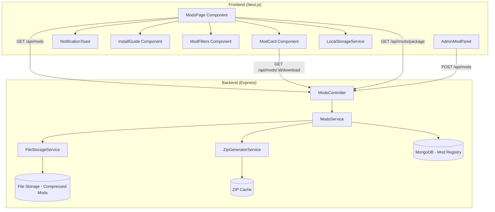

# Design Document: Mods Page

## Overview

La página de mods es un sistema completo para gestionar, distribuir y notificar sobre los mods del servidor Cobblemon Los Pitufos. Incluye un frontend para visualización y descarga, un backend para almacenamiento comprimido y generación de paquetes ZIP, y un sistema de notificaciones basado en LocalStorage para alertar sobre nuevos mods y actualizaciones.

## Architecture



## Components and Interfaces

### Frontend Components

#### 1. ModsPage (`frontend/src/app/mods/page.tsx`)
Componente principal que orquesta la página de mods.

```typescript
interface ModsPageState {
  mods: Mod[];
  loading: boolean;
  error: string | null;
  filter: 'all' | 'required' | 'optional' | 'resourcepacks';
  searchTerm: string;
  newMods: string[]; // IDs of new mods
  updatedMods: string[]; // IDs of mods with updates
  downloading: Record<string, boolean>;
}
```

#### 2. ModCard Component
Tarjeta individual para mostrar información de un mod.

```typescript
interface ModCardProps {
  mod: Mod;
  isNew: boolean;
  hasUpdate: boolean;
  isDownloading: boolean;
  downloadedVersion: string | null;
  onDownload: () => void;
}
```

#### 3. NotificationToast Component
Toast para notificar nuevos mods.

```typescript
interface NotificationToastProps {
  newModsCount: number;
  onViewNew: () => void;
  onDismiss: () => void;
}
```

#### 4. LocalStorageService
Servicio para gestionar el cache local de mods vistos/descargados.

```typescript
interface ModsLocalStorage {
  seenMods: string[]; // IDs of mods the user has seen
  downloadedMods: Record<string, string>; // modId -> version
  lastVisit: string; // ISO date
}

class LocalStorageService {
  static getSeenMods(): string[];
  static markModAsSeen(modId: string): void;
  static getDownloadedVersion(modId: string): string | null;
  static markModAsDownloaded(modId: string, version: string): void;
  static getLastVisit(): Date | null;
  static updateLastVisit(): void;
}
```

### Backend Interfaces

#### Mod Schema (MongoDB)
```typescript
interface Mod {
  _id: string;
  name: string;
  slug: string;
  version: string;
  description: string;
  category: 'required' | 'optional' | 'resourcepack';
  
  // File info
  filename: string;
  originalSize: number; // bytes
  compressedSize: number; // bytes
  checksum: string; // SHA-256
  
  // Compatibility
  minecraftVersion: string;
  modLoader: 'fabric' | 'forge' | 'both';
  
  // Metadata
  author?: string;
  website?: string;
  changelog?: string;
  
  // Status
  isActive: boolean;
  createdAt: Date;
  updatedAt: Date;
  
  // Version history
  previousVersions: Array<{
    version: string;
    filename: string;
    uploadedAt: Date;
  }>;
}
```

#### API Response Types
```typescript
interface ModListResponse {
  mods: Mod[];
  totalRequired: number;
  totalOptional: number;
  totalResourcePacks: number;
  packageVersion: string;
  packageSize: number;
}

interface ModVersionsResponse {
  versions: Record<string, string>; // modId -> version
  packageVersion: string;
}
```

## Data Models

### File Storage Structure
```
/mods-storage/
  /active/
    mod-id-1.jar.gz      # Compressed mod files
    mod-id-2.jar.gz
  /archive/
    mod-id-1-v1.0.0.jar.gz  # Archived versions
  /packages/
    LosPitufos-Mods-v1.0.zip  # Cached ZIP package
```

### LocalStorage Structure
```typescript
// Key: 'cobblemon-mods-cache'
{
  seenMods: ['mod-id-1', 'mod-id-2'],
  downloadedMods: {
    'mod-id-1': '1.2.0',
    'mod-id-2': '2.0.1'
  },
  lastVisit: '2024-12-23T10:00:00Z'
}
```

### ZIP Package Generation
```typescript
interface ZipGenerationOptions {
  compressionLevel: 9; // Maximum compression
  includeReadme: boolean;
  includedCategories: ('required' | 'optional' | 'resourcepack')[];
}
```

## Correctness Properties

*A property is a characteristic or behavior that should hold true across all valid executions of a system-essentially, a formal statement about what the system should do. Properties serve as the bridge between human-readable specifications and machine-verifiable correctness guarantees.*

### Property 1: Mod Count Accuracy
*For any* list of mods, the displayed counts (required, optional, resource packs) SHALL equal the actual counts of mods in each category.
**Validates: Requirements 1.5**

### Property 2: New Mod Detection
*For any* current mod list and cached seen mods list, the detected new mods SHALL be exactly the set difference (current - seen).
**Validates: Requirements 2.1, 2.2**

### Property 3: Version Comparison Correctness
*For any* two semantic versions, the comparison function SHALL correctly determine if an update is available (current > downloaded).
**Validates: Requirements 3.1**

### Property 4: Required Badge Rendering
*For any* mod with category='required', the Mod_Card SHALL render with the "Requerido" badge class.
**Validates: Requirements 1.3**

### Property 5: Search Filter Accuracy
*For any* search term and mod list, the filtered results SHALL contain only mods where name OR description contains the search term (case-insensitive).
**Validates: Requirements 9.2**

### Property 6: ZIP Package Contents
*For any* generated ZIP package, it SHALL contain exactly all active mods marked as 'required'.
**Validates: Requirements 5.1**

### Property 7: Compression Integrity
*For any* compressed mod file, decompressing it SHALL produce a file with checksum matching the stored SHA-256.
**Validates: Requirements 6.1, 6.3**

### Property 8: LocalStorage Update on Download
*For any* successful mod download, the LocalStorage SHALL be updated with the mod ID and version.
**Validates: Requirements 4.3, 3.4**

### Property 9: Soft Delete Preservation
*For any* deleted mod, the mod record SHALL remain in the database with isActive=false.
**Validates: Requirements 7.5**

### Property 10: API Response Completeness
*For any* GET /api/mods request, the response SHALL include all active mods with complete metadata.
**Validates: Requirements 10.1**

### Property 11: OS Detection Accuracy
*For any* user agent string, the OS detection function SHALL correctly identify Windows, Mac, or Linux.
**Validates: Requirements 8.3**

### Property 12: Cache Invalidation
*For any* mod update or addition, the cached ZIP package SHALL be invalidated and regenerated on next request.
**Validates: Requirements 6.5**

## Error Handling

### Frontend Error States
1. **Loading State**: Spinner con "Cargando mods..."
2. **Network Error**: Card con mensaje y botón de reintentar
3. **Download Error**: Toast con error específico y opción de reintentar
4. **Empty State**: Mensaje amigable cuando no hay mods

### Backend Error Handling
1. **Mod Not Found (404)**: `{ error: 'Mod no encontrado', code: 'MOD_NOT_FOUND' }`
2. **File Not Found (404)**: `{ error: 'Archivo no disponible', code: 'FILE_NOT_FOUND' }`
3. **Upload Error (400)**: `{ error: 'Error al procesar archivo', code: 'UPLOAD_ERROR' }`
4. **Compression Error (500)**: `{ error: 'Error de compresión', code: 'COMPRESSION_ERROR' }`

### File Validation
```typescript
function validateModFile(file: Buffer, filename: string): ValidationResult {
  // Check file extension (.jar for mods, .zip for resource packs)
  // Check file size (max 50MB)
  // Verify it's a valid ZIP/JAR archive
  // Extract and validate manifest if JAR
  return { valid: boolean, error?: string, metadata?: ModMetadata };
}
```

## Testing Strategy

### Property-Based Testing (fast-check)
Se utilizará **fast-check** para property-based testing.

```typescript
import fc from 'fast-check';

// Generador para Mod
const modArbitrary = fc.record({
  _id: fc.uuid(),
  name: fc.string({ minLength: 1, maxLength: 50 }),
  version: fc.tuple(fc.integer({min:0,max:99}), fc.integer({min:0,max:99}), fc.integer({min:0,max:99}))
    .map(([major, minor, patch]) => `${major}.${minor}.${patch}`),
  category: fc.constantFrom('required', 'optional', 'resourcepack'),
  isActive: fc.boolean(),
});

// Generador para lista de mods
const modListArbitrary = fc.array(modArbitrary, { minLength: 0, maxLength: 50 });
```

### Unit Tests
- LocalStorageService methods
- Version comparison function
- OS detection function
- Search filter function
- Mod count calculation

### Integration Tests
- API endpoints (GET /api/mods, GET /api/mods/:id/download)
- File upload and compression
- ZIP generation
- Download streaming
