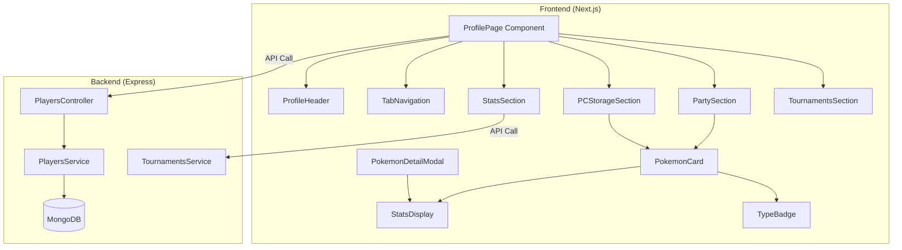

# Design Document: Player Profile Page

## Overview

La página de perfil de jugador es una interfaz completa que muestra toda la información relevante de un jugador de Cobblemon Los Pitufos. Incluye datos del jugador, equipo Pokémon (party), almacenamiento PC, estadísticas detalladas, y historial de torneos. El diseño sigue el estilo visual existente del frontend con glass-morphism, tema oscuro, y colores Pokémon característicos.

## Architecture



## Components and Interfaces

### Frontend Components

#### 1. ProfilePage (`frontend/src/app/jugadores/[uuid]/page.tsx`)
Componente principal que orquesta toda la página de perfil.

```typescript
interface ProfilePageState {
  player: PlayerProfile | null;
  loading: boolean;
  error: string | null;
  activeTab: 'party' | 'pc' | 'stats' | 'tournaments';
  selectedPokemon: Pokemon | null;
  currentPCBox: number;
}
```

#### 2. ProfileHeader Component
Muestra información básica del jugador en la parte superior.

```typescript
interface ProfileHeaderProps {
  username: string;
  balance: number;
  totalPokemon: number;
  uniqueSpecies: number;
  shinies: number;
  starter: StarterInfo | null;
  isOnline: boolean;
  isVerified: boolean;
  lastSync: string;
}
```

#### 3. PokemonCard Component (`frontend/src/components/PokemonCard.tsx`)
Tarjeta reutilizable para mostrar información de un Pokémon.

```typescript
interface PokemonCardProps {
  pokemon: Pokemon;
  size?: 'compact' | 'normal' | 'full';
  onClick?: () => void;
  showStats?: boolean;
}
```

#### 4. PokemonDetailModal Component
Modal expandido con información completa del Pokémon.

```typescript
interface PokemonDetailModalProps {
  pokemon: Pokemon;
  isOpen: boolean;
  onClose: () => void;
}
```

#### 5. StatsDisplay Component
Visualización de estadísticas con barras de progreso.

```typescript
interface StatsDisplayProps {
  stats: PokemonStats;
  type: 'ivs' | 'evs' | 'base';
  showTotal?: boolean;
}
```

#### 6. TypeBadge Component
Badge de tipo con color oficial.

```typescript
interface TypeBadgeProps {
  type: string;
  size?: 'sm' | 'md' | 'lg';
}
```

### Backend Interfaces

#### PlayerProfile Response
```typescript
interface PlayerProfileResponse {
  uuid: string;
  username: string;
  balance: number;
  isOnline: boolean;
  isVerified: boolean;
  lastSync: string;
  registeredAt: string;
  
  starter: {
    id: number;
    name: string;
    nameEs: string;
    isShiny: boolean;
    sprites: PokemonSprites;
  } | null;
  
  party: Pokemon[];
  pc: PCBox[];
  
  stats: {
    totalPokemon: number;
    uniqueSpecies: number;
    shinies: number;
    avgLevel: number;
    strongestPokemon: Pokemon | null;
    typeDistribution: Record<string, number>;
  };
  
  tournaments: TournamentParticipation[];
}
```

#### Pokemon Interface (Extended)
```typescript
interface Pokemon {
  uuid: string;
  species: string;
  speciesId: number;
  nickname?: string;
  level: number;
  experience: number;
  shiny: boolean;
  gender: 'male' | 'female' | 'genderless';
  nature: string;
  ability: string;
  friendship: number;
  ball: string;
  
  ivs: PokemonStats;
  evs: PokemonStats;
  
  moves: PokemonMove[];
  heldItem?: string;
  
  currentHealth: number;
  maxHealth: number;
  status?: string;
  form?: string;
  
  // Computed for frontend
  sprites: {
    sprite: string;
    spriteAnimated: string;
    shiny: string;
    shinyAnimated: string;
    artwork: string;
  };
  types: string[];
}

interface PokemonMove {
  name: string;
  type?: string;
  category?: 'physical' | 'special' | 'status';
  power?: number;
  accuracy?: number;
  pp?: number;
}
```

## Data Models

### Type Color Mapping
```typescript
const TYPE_COLORS: Record<string, string> = {
  normal: 'bg-type-normal',    // #A8A878
  fire: 'bg-type-fire',        // #F08030
  water: 'bg-type-water',      // #6890F0
  electric: 'bg-type-electric', // #F8D030
  grass: 'bg-type-grass',      // #78C850
  ice: 'bg-type-ice',          // #98D8D8
  fighting: 'bg-type-fighting', // #C03028
  poison: 'bg-type-poison',    // #A040A0
  ground: 'bg-type-ground',    // #E0C068
  flying: 'bg-type-flying',    // #A890F0
  psychic: 'bg-type-psychic',  // #F85888
  bug: 'bg-type-bug',          // #A8B820
  rock: 'bg-type-rock',        // #B8A038
  ghost: 'bg-type-ghost',      // #705898
  dragon: 'bg-type-dragon',    // #7038F8
  dark: 'bg-type-dark',        // #705848
  steel: 'bg-type-steel',      // #B8B8D0
  fairy: 'bg-type-fairy',      // #EE99AC
};
```

### IV Color Coding
```typescript
function getIVColor(value: number): string {
  if (value === 31) return 'text-poke-yellow'; // Gold - Perfect
  if (value >= 21) return 'text-poke-green';   // Green - Great
  if (value >= 11) return 'text-yellow-500';   // Yellow - Good
  return 'text-poke-red';                       // Red - Poor
}
```

### Sprite URL Generation
```typescript
function getPokemonSprites(speciesId: number, shiny: boolean): PokemonSprites {
  const hasAnimated = speciesId <= 649;
  const base = 'https://raw.githubusercontent.com/PokeAPI/sprites/master/sprites/pokemon';
  
  return {
    sprite: shiny ? `${base}/shiny/${speciesId}.png` : `${base}/${speciesId}.png`,
    spriteAnimated: hasAnimated
      ? (shiny 
          ? `${base}/versions/generation-v/black-white/animated/shiny/${speciesId}.gif`
          : `${base}/versions/generation-v/black-white/animated/${speciesId}.gif`)
      : (shiny
          ? `${base}/other/showdown/shiny/${speciesId}.gif`
          : `${base}/other/showdown/${speciesId}.gif`),
    artwork: `${base}/other/official-artwork/${speciesId}.png`,
  };
}
```

## Correctness Properties

*A property is a characteristic or behavior that should hold true across all valid executions of a system-essentially, a formal statement about what the system should do. Properties serve as the bridge between human-readable specifications and machine-verifiable correctness guarantees.*

### Property 1: Stat Calculation Correctness
*For any* collection of Pokémon, the calculated stats (totalPokemon, uniqueSpecies, shinies, avgLevel) SHALL match the actual counts and averages from the collection.
**Validates: Requirements 1.4, 6.1**

### Property 2: IV Color Coding Consistency
*For any* IV value between 0 and 31, the getIVColor function SHALL return the correct color class based on the defined thresholds (0-10: red, 11-20: yellow, 21-30: green, 31: gold).
**Validates: Requirements 3.2**

### Property 3: Type Badge Color Mapping
*For any* valid Pokémon type string, the TYPE_COLORS mapping SHALL return the corresponding Tailwind color class.
**Validates: Requirements 2.3, 8.2**

### Property 4: Shiny Styling Application
*For any* Pokémon with shiny=true, the Pokemon_Card SHALL apply the classes 'ring-2 ring-poke-yellow glow-yellow'.
**Validates: Requirements 2.5, 8.4**

### Property 5: Party Size Constraint
*For any* party array, the rendered Pokemon_Cards count SHALL equal min(party.length, 6).
**Validates: Requirements 2.1**

### Property 6: Move Slot Rendering
*For any* Pokémon with N moves (0 ≤ N ≤ 4), the Pokemon_Card SHALL render N move badges plus (4-N) empty slots.
**Validates: Requirements 4.1, 4.4**

### Property 7: PC Box Grid Size
*For any* PC box, the grid SHALL render exactly 30 slots (filled or empty).
**Validates: Requirements 5.2**

### Property 8: Strongest Pokémon Selection
*For any* non-empty collection of Pokémon, the strongestPokemon SHALL be the one with the highest level value.
**Validates: Requirements 6.2**

### Property 9: Type Distribution Calculation
*For any* collection of Pokémon, the typeDistribution record SHALL contain accurate counts for each type present.
**Validates: Requirements 6.3**

### Property 10: API Response Completeness
*For any* valid player UUID, the API response SHALL contain all required fields: uuid, username, balance, party, pc, stats.
**Validates: Requirements 10.1, 10.2, 10.3**

### Property 11: Pokémon Data Serialization Round-Trip
*For any* valid Pokémon object, serializing to JSON and deserializing back SHALL produce an equivalent object.
**Validates: Requirements 11.2**

### Property 12: Stats Constraint Validation
*For any* Pokémon stats, IVs SHALL be in range [0, 31] and EVs SHALL be in range [0, 252] with total EVs ≤ 510.
**Validates: Requirements 11.3**

### Property 13: Empty Slot Placeholder Rendering
*For any* null or undefined slot in PC storage, the UI SHALL render a placeholder element.
**Validates: Requirements 5.5**

### Property 14: Tournament Win Trophy Display
*For any* tournament entry where the player won (position === 1), a trophy icon with gold styling SHALL be displayed.
**Validates: Requirements 7.3**

## Error Handling

### Frontend Error States
1. **Loading State**: Spinner centrado con `animate-spin` mientras se cargan datos
2. **Player Not Found**: Card con mensaje de error y botón para volver a jugadores
3. **Network Error**: Toast notification con opción de reintentar
4. **Invalid Pokemon Data**: Mostrar placeholder con mensaje "Datos no disponibles"

### Backend Error Handling
1. **Player Not Found (404)**: `{ error: 'Jugador no encontrado', code: 'PLAYER_NOT_FOUND' }`
2. **Invalid UUID (400)**: `{ error: 'UUID inválido', code: 'INVALID_UUID' }`
3. **Database Error (500)**: `{ error: 'Error interno del servidor', code: 'DATABASE_ERROR' }`

### Data Sanitization
```typescript
function sanitizePokemon(pokemon: Partial<Pokemon>): Pokemon {
  return {
    uuid: pokemon.uuid || crypto.randomUUID(),
    species: pokemon.species || 'Unknown',
    speciesId: pokemon.speciesId || 0,
    level: Math.min(100, Math.max(1, pokemon.level || 1)),
    shiny: pokemon.shiny || false,
    gender: pokemon.gender || 'genderless',
    nature: pokemon.nature || 'Hardy',
    ability: pokemon.ability || 'Unknown',
    ivs: sanitizeStats(pokemon.ivs, 31),
    evs: sanitizeStats(pokemon.evs, 252),
    moves: (pokemon.moves || []).slice(0, 4),
    // ... other fields with defaults
  };
}
```

## Testing Strategy

### Property-Based Testing (fast-check)
Se utilizará **fast-check** como librería de property-based testing para TypeScript/JavaScript.

Configuración mínima: 100 iteraciones por propiedad.

```typescript
import fc from 'fast-check';

// Ejemplo de generador para Pokémon
const pokemonArbitrary = fc.record({
  uuid: fc.uuid(),
  species: fc.string({ minLength: 1, maxLength: 20 }),
  speciesId: fc.integer({ min: 1, max: 1010 }),
  level: fc.integer({ min: 1, max: 100 }),
  shiny: fc.boolean(),
  // ... otros campos
});
```

### Unit Tests
- Funciones de utilidad (getIVColor, getPokemonSprites, TYPE_COLORS)
- Cálculos de estadísticas (totalPokemon, avgLevel, typeDistribution)
- Sanitización de datos
- Validación de esquemas

### Integration Tests
- API endpoint `/api/players/:uuid` response structure
- Frontend rendering con datos mock
- Tab navigation state management
