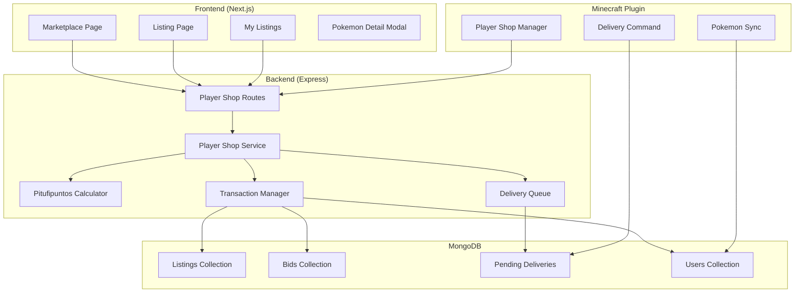

# Player Shop - Design Document

## Overview

La Player Shop es un sistema de mercado peer-to-peer que permite a los jugadores vender sus Pokémon a otros jugadores por CobbleDollars. El sistema soporta dos métodos de venta: compra directa (precio fijo) y subastas (bidding). Incluye un sistema de puntuación llamado "Pitufipuntos" que calcula el poder total de cada Pokémon basándose en sus estadísticas individuales.

El sistema se integra con:
- **Frontend (Next.js)**: Interfaz web para listar, buscar y comprar Pokémon
- **Backend (Express/MongoDB)**: API REST para gestión de listings, transacciones y cálculos
- **Plugin Minecraft (Fabric)**: Entrega de Pokémon, sincronización de datos y comandos in-game

## Architecture



## Components and Interfaces

### Backend Components

#### 1. PlayerShopService (`backend/src/modules/player-shop/player-shop.service.ts`)

```typescript
interface PlayerShopService {
  // Listings
  createListing(sellerId: string, pokemonUuid: string, options: ListingOptions): Promise<Listing>;
  getListing(listingId: string): Promise<ListingDetail>;
  getActiveListings(filters: ListingFilters): Promise<PaginatedListings>;
  getMyListings(userId: string): Promise<Listing[]>;
  cancelListing(listingId: string, userId: string): Promise<void>;
  
  // Purchases
  purchaseDirect(listingId: string, buyerId: string): Promise<PurchaseResult>;
  
  // Bidding
  placeBid(listingId: string, bidderId: string, amount: number): Promise<BidResult>;
  getBidHistory(listingId: string): Promise<Bid[]>;
  processExpiredAuctions(): Promise<void>;
  
  // Delivery
  getPendingDeliveries(playerUuid: string): Promise<PendingDelivery[]>;
  markDelivered(deliveryId: string): Promise<void>;
}
```

#### 2. PitufipuntosCalculator (`backend/src/modules/player-shop/pitufipuntos.service.ts`)

```typescript
interface PitufipuntosCalculator {
  calculate(pokemon: Pokemon): PitufipuntosResult;
  getBreakdown(pokemon: Pokemon): PitufipuntosBreakdown;
}

interface PitufipuntosResult {
  total: number;
  breakdown: PitufipuntosBreakdown;
}

interface PitufipuntosBreakdown {
  baseStatTotal: number;
  ivBonus: number;        // IVTotal * 2
  evBonus: number;        // EVTotal / 4
  levelBonus: number;     // level * 5
  natureBonus: number;    // 0-150 based on nature alignment
  abilityBonus: number;   // 100 if hidden ability
  shinyBonus: number;     // 200 if shiny
  typeBonus: number;      // Based on type effectiveness
}
```

#### 3. TransactionManager (extends existing)

```typescript
interface PlayerShopTransaction {
  executeListingCreation(sellerId: string, pokemonUuid: string, options: ListingOptions): Promise<Listing>;
  executeDirectPurchase(listingId: string, buyerId: string): Promise<PurchaseResult>;
  executeBidPlacement(listingId: string, bidderId: string, amount: number): Promise<BidResult>;
  executeAuctionCompletion(listingId: string): Promise<void>;
  executeListingCancellation(listingId: string): Promise<void>;
}
```

### Frontend Components

#### 1. MarketplacePage (`frontend/src/app/mercado/page.tsx`)
- Grid de listings activos con filtros
- Búsqueda por especie, tipo, precio
- Ordenamiento por Pitufipuntos, precio, tiempo restante

#### 2. ListingCard (`frontend/src/components/ListingCard.tsx`)
- Sprite del Pokémon (animado si disponible)
- Indicador shiny
- Nivel y Pitufipuntos
- Precio o puja actual
- Tiempo restante (para subastas)

#### 3. PokemonDetailModal (`frontend/src/components/PokemonDetailModal.tsx`)
- Vista completa de estadísticas
- IVs con código de colores
- EVs con barras visuales
- Breakdown de Pitufipuntos
- Botón de compra/puja

#### 4. CreateListingModal (`frontend/src/components/CreateListingModal.tsx`)
- Selector de Pokémon (Party/PC)
- Selector de método de venta
- Input de precio/puja inicial
- Selector de duración (para subastas)

### Plugin Components

#### 1. PlayerShopManager (`minecraft-plugin-v2/src/main/java/.../playershop/PlayerShopManager.java`)

```java
public class PlayerShopManager {
    // Poll for pending deliveries
    void pollPendingDeliveries();
    
    // Deliver Pokemon to player
    void deliverPokemon(ServerPlayerEntity player, PendingDelivery delivery);
    
    // Handle /claimmarket command
    void handleClaimCommand(ServerPlayerEntity player);
    
    // Remove Pokemon from player for listing
    void escrowPokemon(ServerPlayerEntity player, String pokemonUuid);
    
    // Return Pokemon from escrow on cancel
    void returnFromEscrow(ServerPlayerEntity player, String pokemonUuid);
}
```

## Data Models

### Listing Schema

```typescript
interface Listing {
  _id: ObjectId;
  sellerId: string;           // minecraftUuid
  sellerUsername: string;
  
  // Pokemon data (snapshot at listing time)
  pokemon: {
    uuid: string;
    species: string;
    speciesId: number;
    level: number;
    shiny: boolean;
    gender: string;
    nature: string;
    ability: string;
    ivs: PokemonStats;
    evs: PokemonStats;
    moves: PokemonMove[];
    ball: string;
    form?: string;
  };
  
  pitufipuntos: PitufipuntosResult;
  
  // Sale configuration
  saleMethod: 'direct' | 'bidding';
  price?: number;              // For direct purchase
  startingBid?: number;        // For bidding
  currentBid?: number;         // Current highest bid
  currentBidderId?: string;    // Current highest bidder
  bidCount: number;
  
  // Timing
  duration?: number;           // Hours (24-72 for bidding)
  expiresAt?: Date;            // For bidding
  createdAt: Date;
  
  // Status
  status: 'active' | 'sold' | 'cancelled' | 'expired';
  soldAt?: Date;
  buyerId?: string;
  buyerUsername?: string;
  finalPrice?: number;
}
```

### Bid Schema

```typescript
interface Bid {
  _id: ObjectId;
  listingId: ObjectId;
  bidderId: string;           // minecraftUuid
  bidderUsername: string;
  amount: number;
  reservedFromBalance: boolean;
  createdAt: Date;
  status: 'active' | 'outbid' | 'won' | 'refunded';
  refundedAt?: Date;
}
```

### PendingDelivery Schema

```typescript
interface PendingDelivery {
  _id: ObjectId;
  recipientUuid: string;
  recipientUsername: string;
  
  type: 'purchase' | 'auction_win' | 'escrow_return';
  
  pokemon: Pokemon;           // Full Pokemon data
  
  sourceListingId?: ObjectId;
  
  createdAt: Date;
  deliveredAt?: Date;
  status: 'pending' | 'delivered' | 'failed';
  deliveryAttempts: number;
  lastAttemptAt?: Date;
  failureReason?: string;
}
```

## Correctness Properties

*A property is a characteristic or behavior that should hold true across all valid executions of a system-essentially, a formal statement about what the system should do. Properties serve as the bridge between human-readable specifications and machine-verifiable correctness guarantees.*

### Property 1: Pitufipuntos Calculation Determinism
*For any* Pokémon with the same stats, IVs, EVs, nature, ability, and shiny status, the Pitufipuntos calculation SHALL produce the same result.
**Validates: Requirements 3.1, 3.6**

### Property 2: Pitufipuntos Component Additivity
*For any* Pokémon, the total Pitufipuntos SHALL equal the sum of all breakdown components (baseStatTotal + ivBonus + evBonus + levelBonus + natureBonus + abilityBonus + shinyBonus + typeBonus).
**Validates: Requirements 3.1, 3.5**

### Property 3: Shiny Bonus Application
*For any* shiny Pokémon, the Pitufipuntos SHALL include exactly 200 shinyBonus points compared to an identical non-shiny Pokémon.
**Validates: Requirements 3.4**

### Property 4: Hidden Ability Bonus Application
*For any* Pokémon with a hidden ability, the Pitufipuntos SHALL include exactly 100 abilityBonus points.
**Validates: Requirements 3.3**

### Property 5: Price Validation Bounds
*For any* Direct_Purchase listing, the price SHALL be between 100 and 10,000,000 CobbleDollars inclusive.
**Validates: Requirements 1.3**

### Property 6: Bid Duration Bounds
*For any* Bidding listing, the duration SHALL be between 24 and 72 hours inclusive.
**Validates: Requirements 1.4**

### Property 7: Minimum Bid Increment
*For any* bid on an auction, the bid amount SHALL exceed the current highest bid by at least 5%.
**Validates: Requirements 5.1**

### Property 8: Currency Conservation on Purchase
*For any* completed direct purchase, the sum of buyer's balance decrease and seller's balance increase SHALL equal the listing price (no currency created or destroyed).
**Validates: Requirements 4.3, 8.2**

### Property 9: Currency Conservation on Bid Reservation
*For any* placed bid, the bidder's available balance SHALL decrease by exactly the bid amount, and the reserved amount SHALL equal the bid amount.
**Validates: Requirements 5.3**

### Property 10: Currency Release on Outbid
*For any* outbid event, the previous bidder's available balance SHALL increase by exactly their previous bid amount.
**Validates: Requirements 5.4**

### Property 11: Escrow State Exclusivity
*For any* Pokémon, it SHALL exist in exactly one state: in player storage, in escrow (active listing), or in pending delivery.
**Validates: Requirements 1.5, 4.4, 8.1**

### Property 12: Listing Serialization Round-Trip
*For any* valid Listing object, serializing to JSON and deserializing back SHALL produce an equivalent Listing object.
**Validates: Requirements 10.1, 10.2, 10.3**

### Property 13: Pitufipuntos Serialization Round-Trip
*For any* PitufipuntosResult, serializing to JSON and deserializing back SHALL produce an equivalent result with all component values preserved.
**Validates: Requirements 10.4**

### Property 14: Filter Correctness - Species
*For any* species filter applied to listings, all returned listings SHALL contain Pokémon of the specified species.
**Validates: Requirements 2.2**

### Property 15: Filter Correctness - Price Range
*For any* price range filter, all returned listings SHALL have prices within the specified minimum and maximum bounds.
**Validates: Requirements 2.4**

### Property 16: Sort Correctness - Pitufipuntos
*For any* sort by Pitufipuntos, the returned listings SHALL be ordered by Pitufipuntos value in the specified direction (ascending or descending).
**Validates: Requirements 2.6**

## Error Handling

### Backend Errors

| Error Code | Description | HTTP Status |
|------------|-------------|-------------|
| `LISTING_NOT_FOUND` | Listing does not exist | 404 |
| `POKEMON_NOT_FOUND` | Pokemon not in player's storage | 404 |
| `POKEMON_IN_ESCROW` | Pokemon already listed | 400 |
| `INSUFFICIENT_BALANCE` | Not enough CobbleDollars | 400 |
| `BID_TOO_LOW` | Bid doesn't meet minimum increment | 400 |
| `AUCTION_ENDED` | Auction has already ended | 400 |
| `CANNOT_CANCEL_WITH_BIDS` | Cannot cancel auction with active bids | 400 |
| `NOT_LISTING_OWNER` | User is not the seller | 403 |
| `CANNOT_BUY_OWN_LISTING` | Seller cannot buy their own listing | 400 |
| `INVALID_PRICE` | Price outside valid range | 400 |
| `INVALID_DURATION` | Duration outside valid range | 400 |

### Plugin Error Handling

- **Delivery Failed (Full Storage)**: Queue retry, notify player to make space
- **Pokemon Not Found**: Log error, mark delivery as failed, notify admin
- **Network Error**: Exponential backoff retry (5s, 15s, 30s, 60s)

## Testing Strategy

### Property-Based Testing Library
- **Backend**: `fast-check` for TypeScript
- **Minimum iterations**: 100 per property test

### Unit Tests
- Pitufipuntos calculation with known inputs
- Price/duration validation edge cases
- Filter and sort operations
- Transaction state transitions

### Property-Based Tests
Each correctness property will have a corresponding property-based test:

1. **Pitufipuntos tests**: Generate random Pokemon stats, verify calculation consistency
2. **Transaction tests**: Generate random purchase/bid scenarios, verify currency conservation
3. **Serialization tests**: Generate random listings, verify round-trip consistency
4. **Filter tests**: Generate random listings and filters, verify filter correctness

### Integration Tests
- Full purchase flow (list → buy → deliver)
- Full auction flow (list → bid → outbid → win → deliver)
- Cancellation flows
- Offline delivery queue

### Test Annotations
All property-based tests will be annotated with:
```typescript
// **Feature: player-shop, Property {number}: {property_text}**
// **Validates: Requirements X.Y**
```
