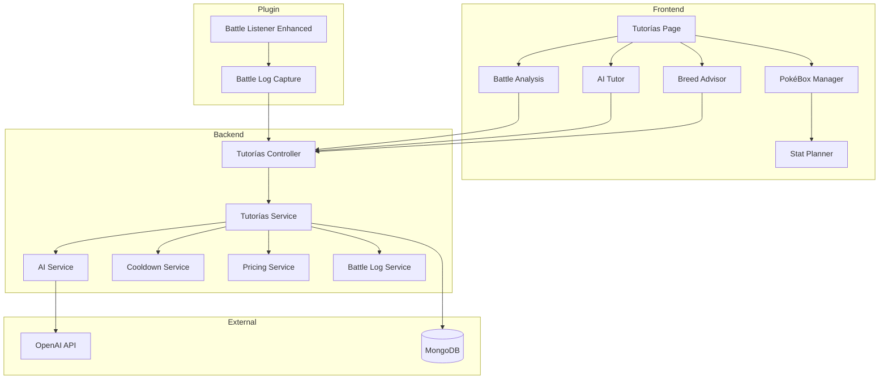

# Design Document: Tutorías Page

## Overview

La página de Tutorías es un centro de servicios premium impulsados por IA para jugadores de Cobblemon Los Pitufos. El sistema integra:

1. **Battle Analysis AI** - Análisis detallado de batallas guardadas paso a paso
2. **AI Tutor** - Consultas personalizadas sobre mejora de equipos
3. **Breed Advisor AI** - Consejos de breeding basados en mecánicas de Cobbreeding
4. **PokéBox Manager** - Gestión avanzada de Pokémon con filtros, duplicados, y calculadoras

Todos los servicios de IA tienen costo en CobbleDollars y cooldowns configurables.

## Architecture



## Components and Interfaces

### Frontend Components

#### TutoriasPage (`/tutorias`)
Dashboard principal con cards para cada servicio.

```typescript
interface TutoriasPageProps {
  userBalance: number;
  cooldowns: ServiceCooldowns;
  pricing: ServicePricing;
}

interface ServiceCooldowns {
  battleAnalysis: number | null; // timestamp de cuando expira, null si disponible
  aiTutor: number | null;
  breedAdvisor: number | null;
}

interface ServicePricing {
  battleAnalysis: number;
  aiTutor: number;
  breedAdvisor: number;
}
```

#### BattleAnalysisPage (`/tutorias/battle-analysis`)
Interfaz para ver historial de batallas y solicitar análisis.

```typescript
interface BattleSummary {
  id: string;
  date: string;
  opponent: string;
  opponentUuid: string;
  result: 'WIN' | 'LOSS' | 'DRAW';
  duration: number; // ms
  turns: number;
  analyzed: boolean;
}

interface BattleAnalysisRequest {
  battleId: string;
}

interface BattleAnalysisResponse {
  battleId: string;
  summary: string;
  turnByTurn: TurnAnalysis[];
  keyMoments: KeyMoment[];
  recommendations: string[];
  overallRating: number; // 1-10
}

interface TurnAnalysis {
  turn: number;
  playerMove: MoveAction;
  opponentMove: MoveAction;
  analysis: string;
  alternativePlay?: string;
}

interface KeyMoment {
  turn: number;
  description: string;
  impact: 'POSITIVE' | 'NEGATIVE' | 'NEUTRAL';
}
```

#### AITutorPage (`/tutorias/ai-tutor`)
Chat interface para consultas de equipo.

```typescript
interface AITutorRequest {
  question: string;
  includeTeamData: boolean;
}

interface AITutorResponse {
  answer: string;
  teamAnalysis?: TeamAnalysis;
  suggestions: Suggestion[];
}

interface TeamAnalysis {
  strengths: string[];
  weaknesses: string[];
  typeChart: TypeCoverage;
}

interface Suggestion {
  type: 'MOVESET' | 'POKEMON' | 'ITEM' | 'EV_SPREAD' | 'NATURE';
  target: string; // Pokemon name or general
  suggestion: string;
  reasoning: string;
}
```

#### BreedAdvisorPage (`/tutorias/breed-advisor`)
Interfaz para consejos de breeding.

```typescript
interface BreedAdvisorRequest {
  targetSpecies?: string;
  targetIVs?: Partial<PokemonStats>;
  targetNature?: string;
  targetAbility?: string;
  includeShinyAdvice: boolean;
}

interface BreedAdvisorResponse {
  breedingPairs: BreedingPair[];
  breedingChain: BreedingStep[];
  ivInheritance: IVInheritanceInfo;
  abilityInheritance: AbilityInheritanceInfo;
  shinyOdds?: ShinyOddsInfo;
  estimatedEggs: number;
}

interface BreedingPair {
  parent1: PokemonSummary;
  parent2: PokemonSummary;
  compatibility: number; // 0-100
  eggGroup: string;
  expectedIVs: PokemonStats;
}

interface BreedingStep {
  step: number;
  parents: [string, string];
  expectedResult: string;
  itemsNeeded: string[];
  notes: string;
}

interface ShinyOddsInfo {
  baseOdds: string;
  masudaBonus: boolean;
  crystalBonus: number;
  finalOdds: string;
  expectedEggs: number;
}
```

#### PokeBoxManagerPage (`/tutorias/pokebox`)
Gestión de PC storage.

```typescript
interface PokeBoxFilters {
  species?: string;
  types?: string[];
  shiny?: boolean;
  ivMin?: number; // percentage
  ivMax?: number;
  evTotal?: { min: number; max: number };
  nature?: string;
  ability?: string;
  levelRange?: { min: number; max: number };
}

interface DuplicateGroup {
  species: string;
  speciesId: number;
  pokemon: PokemonWithCalculations[];
  suggestedKeep: string; // uuid of best one
}

interface PokemonWithCalculations extends Pokemon {
  ivPercentage: number;
  evRemaining: number;
  isProtected: boolean;
}

interface ProtectionUpdate {
  pokemonUuid: string;
  protected: boolean;
}
```

#### StatPlannerModal
Modal para planificar EVs.

```typescript
interface StatPlannerProps {
  pokemon: Pokemon;
  onSave: (plan: EVPlan) => void;
}

interface EVPlan {
  pokemonUuid: string;
  evDistribution: PokemonStats;
  projectedStats50: PokemonStats;
  projectedStats100: PokemonStats;
  savedAt: string;
}

interface StatCalculation {
  base: number;
  iv: number;
  ev: number;
  nature: number; // 0.9, 1.0, or 1.1
  level: number;
  final: number;
}
```

### Backend Services

#### TutoriasController
Endpoints para todos los servicios de tutorías.

```typescript
// Routes
POST /api/tutorias/battle-analysis/request
GET  /api/tutorias/battle-analysis/history
GET  /api/tutorias/battle-analysis/:battleId

POST /api/tutorias/ai-tutor/ask
GET  /api/tutorias/ai-tutor/history

POST /api/tutorias/breed-advisor/ask

GET  /api/tutorias/pokebox
POST /api/tutorias/pokebox/protect
GET  /api/tutorias/pokebox/duplicates

GET  /api/tutorias/pricing
PUT  /api/tutorias/pricing (admin)

GET  /api/tutorias/cooldowns
```

#### TutoriasService
Lógica de negocio principal.

```typescript
class TutoriasService {
  async requestBattleAnalysis(userId: string, battleId: string): Promise<BattleAnalysisResponse>;
  async getBattleHistory(userId: string): Promise<BattleSummary[]>;
  async askAITutor(userId: string, request: AITutorRequest): Promise<AITutorResponse>;
  async askBreedAdvisor(userId: string, request: BreedAdvisorRequest): Promise<BreedAdvisorResponse>;
  async getPokeBox(userId: string, filters?: PokeBoxFilters): Promise<PokemonWithCalculations[]>;
  async getDuplicates(userId: string): Promise<DuplicateGroup[]>;
  async updateProtection(userId: string, update: ProtectionUpdate): Promise<void>;
  async saveEVPlan(userId: string, plan: EVPlan): Promise<void>;
}
```

#### CooldownService
Gestión de cooldowns por usuario y servicio.

```typescript
class CooldownService {
  async checkCooldown(userId: string, serviceType: ServiceType): Promise<CooldownStatus>;
  async recordRequest(userId: string, serviceType: ServiceType): Promise<void>;
  async getCooldowns(userId: string): Promise<ServiceCooldowns>;
}

interface CooldownStatus {
  allowed: boolean;
  remainingMs?: number;
  expiresAt?: number;
}

type ServiceType = 'BATTLE_ANALYSIS' | 'AI_TUTOR' | 'BREED_ADVISOR';
```

#### PricingService
Gestión de precios de servicios.

```typescript
class PricingService {
  async getPrice(serviceType: ServiceType): Promise<number>;
  async getAllPrices(): Promise<ServicePricing>;
  async updatePrice(serviceType: ServiceType, price: number): Promise<void>;
  async chargeUser(userId: string, serviceType: ServiceType): Promise<ChargeResult>;
}

interface ChargeResult {
  success: boolean;
  newBalance?: number;
  error?: 'INSUFFICIENT_BALANCE';
  requiredAmount?: number;
}
```

#### BattleLogService
Almacenamiento y recuperación de logs de batalla.

```typescript
class BattleLogService {
  async storeBattleLog(log: BattleLog): Promise<string>;
  async getBattleLog(battleId: string): Promise<BattleLog>;
  async getBattlesForUser(userId: string): Promise<BattleSummary[]>;
}

interface BattleLog {
  id: string;
  player1Uuid: string;
  player2Uuid: string;
  startTime: string;
  endTime: string;
  winner: string;
  turns: TurnLog[];
  initialState: BattleState;
  finalState: BattleState;
}

interface TurnLog {
  turnNumber: number;
  player1Action: BattleAction;
  player2Action: BattleAction;
  fieldState: FieldState;
  events: BattleEvent[];
}

interface BattleAction {
  type: 'MOVE' | 'SWITCH' | 'ITEM' | 'FORFEIT';
  pokemon?: string;
  move?: string;
  target?: string;
  damage?: number;
  critical?: boolean;
  effectiveness?: 'SUPER' | 'NORMAL' | 'NOT_VERY' | 'IMMUNE';
  statusApplied?: string;
}

interface FieldState {
  weather?: string;
  terrain?: string;
  hazards: { side: string; type: string }[];
}
```

#### AIService
Integración con OpenAI para análisis.

```typescript
class AIService {
  async analyzeBattle(battleLog: BattleLog): Promise<BattleAnalysisResponse>;
  async answerTeamQuestion(question: string, teamData: Pokemon[]): Promise<AITutorResponse>;
  async getBreedingAdvice(request: BreedAdvisorRequest, availablePokemon: Pokemon[]): Promise<BreedAdvisorResponse>;
}
```

### Plugin Components

#### BattleLogCapture
Captura detallada de batallas en el plugin.

```java
public class BattleLogCapture {
    // Capture battle start with initial state
    public void onBattleStart(PokemonBattle battle);
    
    // Capture each turn's actions
    public void onTurnExecuted(PokemonBattle battle, int turnNumber);
    
    // Capture switches
    public void onPokemonSwitch(PokemonBattle battle, Pokemon outgoing, Pokemon incoming);
    
    // Capture battle end and send to API
    public void onBattleEnd(PokemonBattle battle, UUID winner);
    
    // Build complete battle log
    private BattleLog buildBattleLog();
}
```

## Data Models

### MongoDB Collections

#### tutorias_battle_logs
```typescript
interface BattleLogDocument {
  _id: ObjectId;
  battleId: string;
  player1Uuid: string;
  player1Username: string;
  player2Uuid: string;
  player2Username: string;
  winner: string;
  result: 'KO' | 'FORFEIT' | 'TIMEOUT';
  startTime: Date;
  endTime: Date;
  duration: number;
  turnCount: number;
  turns: TurnLog[];
  initialState: BattleState;
  analyzed: boolean;
  analysisResult?: BattleAnalysisResponse;
  createdAt: Date;
}
```

#### tutorias_cooldowns
```typescript
interface CooldownDocument {
  _id: ObjectId;
  discordId: string;
  serviceType: ServiceType;
  lastRequest: Date;
  expiresAt: Date;
}
```

#### tutorias_pricing
```typescript
interface PricingDocument {
  _id: ObjectId;
  serviceType: ServiceType;
  price: number;
  cooldownMinutes: number;
  updatedAt: Date;
  updatedBy: string;
}
```

#### tutorias_ev_plans
```typescript
interface EVPlanDocument {
  _id: ObjectId;
  discordId: string;
  pokemonUuid: string;
  pokemonSpecies: string;
  evDistribution: PokemonStats;
  projectedStats50: PokemonStats;
  projectedStats100: PokemonStats;
  createdAt: Date;
  updatedAt: Date;
}
```

#### tutorias_protected_pokemon
```typescript
interface ProtectedPokemonDocument {
  _id: ObjectId;
  discordId: string;
  pokemonUuid: string;
  protectedAt: Date;
}
```

## Correctness Properties

*A property is a characteristic or behavior that should hold true across all valid executions of a system-essentially, a formal statement about what the system should do. Properties serve as the bridge between human-readable specifications and machine-verifiable correctness guarantees.*

### Property 1: Service Payment Deduction
*For any* user with sufficient CobbleDollars balance requesting any AI service, the user's balance after the request SHALL equal their previous balance minus the configured service price.
**Validates: Requirements 1.4, 2.3, 3.4**

### Property 2: Insufficient Balance Rejection
*For any* user with CobbleDollars balance less than the service price, requesting that AI service SHALL be rejected and the user's balance SHALL remain unchanged.
**Validates: Requirements 1.5, 2.4, 3.5**

### Property 3: Battle Log Completeness
*For any* battle log stored by the system, the log SHALL contain all required fields: both player UUIDs, start/end times, winner, and at least one turn with move actions.
**Validates: Requirements 1.1, 8.1, 8.2, 8.4**

### Property 4: Turn Record Completeness
*For any* turn recorded in a battle log, the turn SHALL contain the move used, target, damage dealt, and effectiveness for each player's action.
**Validates: Requirements 8.2, 8.5**

### Property 5: Battle History Retrieval
*For any* user requesting their battle history, all battles where the user was a participant SHALL be returned with date, opponent, and result fields.
**Validates: Requirements 1.6**

### Property 6: Cooldown Enforcement
*For any* user who has made an AI request, subsequent requests of the same type within the cooldown period SHALL be rejected with remaining time displayed.
**Validates: Requirements 6.1, 6.2**

### Property 7: Cooldown Expiration
*For any* user whose cooldown has expired (current time > cooldown expiration), the next AI request of that type SHALL be allowed.
**Validates: Requirements 6.4**

### Property 8: Independent Service Cooldowns
*For any* user, cooldowns for Battle_Analysis_AI, AI_Tutor, and Breed_Advisor_AI SHALL be tracked independently, allowing requests to different services regardless of other cooldowns.
**Validates: Requirements 6.3**

### Property 9: Filter Correctness
*For any* filter criteria applied to PokéBox, all returned Pokémon SHALL match all specified filter conditions.
**Validates: Requirements 4.2**

### Property 10: Duplicate Grouping
*For any* duplicate detection request, Pokémon SHALL be grouped by species, and each group SHALL contain only Pokémon of the same speciesId.
**Validates: Requirements 4.3**

### Property 11: Protection Exclusion
*For any* Pokémon marked as protected, that Pokémon SHALL NOT appear in release suggestions when viewing duplicates.
**Validates: Requirements 4.4**

### Property 12: IV Percentage Calculation
*For any* Pokémon, the IV percentage SHALL equal (sum of all IVs / 186) * 100, where 186 is the maximum possible IV total (31 * 6).
**Validates: Requirements 4.5**

### Property 13: EV Remaining Calculation
*For any* Pokémon, the remaining EVs SHALL equal 510 minus the sum of all current EVs.
**Validates: Requirements 4.6**

### Property 14: Stat Calculation with Nature
*For any* stat calculation, if the nature boosts that stat, the final value SHALL be multiplied by 1.1; if it reduces, by 0.9; otherwise by 1.0.
**Validates: Requirements 5.3**

### Property 15: EV Plan Round Trip
*For any* EV plan saved for a Pokémon, retrieving that plan SHALL return the same EV distribution that was saved.
**Validates: Requirements 5.4**

### Property 16: Price Update Propagation
*For any* price update by an admin, subsequent service requests SHALL use the new price immediately.
**Validates: Requirements 7.2**

### Property 17: Balance Display Consistency
*For any* service page in Tutorías, the displayed CobbleDollars balance SHALL match the user's last synced balance from the plugin.
**Validates: Requirements 9.3**

### Property 18: Pending Sync Creation
*For any* AI service request that is approved, the system SHALL create a pending deduction record that the plugin can process.
**Validates: Requirements 10.1**

### Property 19: Daily Limit Enforcement
*For any* user who has reached their daily limit for a service type, subsequent requests of that type SHALL be rejected until the limit resets.
**Validates: Requirements 11.1, 11.2**

### Property 20: Daily Limit Reset
*For any* user, their daily usage count SHALL reset to zero at midnight server time.
**Validates: Requirements 11.4**

### Property 18: Transaction Ledger Integrity
*For any* user, the sum of all credit transactions minus the sum of all debit transactions in the ledger SHALL equal the user's current balance.
**Validates: Anti-Tamper System**

### Property 19: Signed Request Validation
*For any* request from the plugin without a valid HMAC signature, the backend SHALL reject the request and log a suspicious activity event.
**Validates: Anti-Tamper System**

### Property 20: Balance Jump Detection
*For any* balance sync where the reported balance exceeds the current balance plus the maximum allowed increase, the sync SHALL be rejected and flagged as suspicious.
**Validates: Anti-Tamper System**

### Property 21: Progressive Cooldown Scaling
*For any* user with N uses of a service in 24 hours, the cooldown duration SHALL be multiplied by the appropriate tier multiplier (1x for 1-3, 2x for 4-6, 4x for 7-9, 8x for 10+).
**Validates: Anti-Abuse System**

### Property 22: Replay Attack Prevention
*For any* request with a timestamp older than 5 minutes or a previously used nonce, the backend SHALL reject the request.
**Validates: Anti-Tamper System**

## Anti-Tamper & Anti-Abuse System

### CobbleDollars Balance Integrity

#### Server-Side Balance Authority
El backend es la **única fuente de verdad** para el balance de CobbleDollars. El plugin solo reporta, nunca modifica directamente.

```typescript
interface BalanceTransaction {
  id: string;
  discordId: string;
  minecraftUuid: string;
  type: 'CREDIT' | 'DEBIT';
  amount: number;
  source: TransactionSource;
  sourceId?: string; // battleId, serviceType, etc.
  previousBalance: number;
  newBalance: number;
  timestamp: Date;
  signature: string; // HMAC signature for integrity
}

type TransactionSource = 
  | 'PLUGIN_SYNC'      // From Minecraft plugin
  | 'SERVICE_CHARGE'   // AI service payment
  | 'ADMIN_ADJUST'     // Manual admin adjustment
  | 'GACHA_PURCHASE'   // Gacha system
  | 'SHOP_PURCHASE'    // Shop system
  | 'TOURNAMENT_PRIZE' // Tournament winnings
  | 'REFUND';          // Refund operation
```

#### Balance Sync Validation

```typescript
class BalanceIntegrityService {
  // Validate incoming balance from plugin
  async validatePluginSync(
    uuid: string, 
    reportedBalance: number,
    signature: string
  ): Promise<ValidationResult> {
    // 1. Verify HMAC signature from plugin
    const isValidSignature = this.verifyPluginSignature(uuid, reportedBalance, signature);
    if (!isValidSignature) {
      await this.flagSuspiciousActivity(uuid, 'INVALID_SIGNATURE');
      return { valid: false, reason: 'SIGNATURE_MISMATCH' };
    }
    
    // 2. Check for impossible balance jumps
    const currentBalance = await this.getCurrentBalance(uuid);
    const maxAllowedIncrease = this.getMaxAllowedIncrease(uuid);
    
    if (reportedBalance > currentBalance + maxAllowedIncrease) {
      await this.flagSuspiciousActivity(uuid, 'IMPOSSIBLE_BALANCE_JUMP', {
        current: currentBalance,
        reported: reportedBalance,
        maxAllowed: maxAllowedIncrease
      });
      return { valid: false, reason: 'BALANCE_JUMP_TOO_LARGE' };
    }
    
    // 3. Rate limit balance increases
    const recentIncreases = await this.getRecentIncreases(uuid, '1h');
    if (recentIncreases > this.config.maxHourlyIncrease) {
      await this.flagSuspiciousActivity(uuid, 'RATE_LIMIT_EXCEEDED');
      return { valid: false, reason: 'RATE_LIMIT' };
    }
    
    return { valid: true };
  }
  
  // Calculate max allowed increase based on player activity
  getMaxAllowedIncrease(uuid: string): number {
    // Base: 10,000 per sync
    // + bonuses for legitimate activities (battles won, pokemon caught, etc.)
    return 10000 + this.getLegitimateEarningsPotential(uuid);
  }
}
```

#### Transaction Ledger
Todas las transacciones se registran en un ledger inmutable:

```typescript
interface TransactionLedger {
  // Atomic balance operations with full audit trail
  async debit(userId: string, amount: number, source: TransactionSource, sourceId?: string): Promise<TransactionResult>;
  async credit(userId: string, amount: number, source: TransactionSource, sourceId?: string): Promise<TransactionResult>;
  
  // Verify ledger integrity
  async verifyUserLedger(userId: string): Promise<LedgerVerification>;
  
  // Detect anomalies
  async detectAnomalies(userId: string): Promise<Anomaly[]>;
}

interface LedgerVerification {
  valid: boolean;
  currentBalance: number;
  calculatedBalance: number; // Sum of all transactions
  discrepancy?: number;
  suspiciousTransactions: TransactionId[];
}
```

### Plugin-Side Security

#### Signed Requests
El plugin firma todas las requests con HMAC:

```java
public class SecureHttpClient {
    private final String secretKey;
    
    public JsonObject signedPost(String endpoint, JsonObject payload) {
        // Add timestamp to prevent replay attacks
        payload.addProperty("timestamp", System.currentTimeMillis());
        payload.addProperty("nonce", generateNonce());
        
        // Generate HMAC signature
        String dataToSign = payload.toString();
        String signature = generateHMAC(dataToSign, secretKey);
        payload.addProperty("signature", signature);
        
        return httpClient.post(endpoint, payload);
    }
    
    private String generateHMAC(String data, String key) {
        Mac mac = Mac.getInstance("HmacSHA256");
        SecretKeySpec secretKeySpec = new SecretKeySpec(key.getBytes(), "HmacSHA256");
        mac.init(secretKeySpec);
        return Base64.getEncoder().encodeToString(mac.doFinal(data.getBytes()));
    }
}
```

#### Balance Change Events
Solo eventos específicos pueden aumentar el balance:

```java
public class CobbleDollarsManager {
    // Whitelist of valid earning sources
    private static final Set<String> VALID_EARNING_SOURCES = Set.of(
        "POKEMON_CAUGHT",
        "BATTLE_WON",
        "DAILY_REWARD",
        "SYNERGY_BONUS",
        "TOURNAMENT_PRIZE",
        "ADMIN_GRANT"
    );
    
    public void addBalance(UUID player, int amount, String source) {
        if (!VALID_EARNING_SOURCES.contains(source)) {
            logger.warn("Invalid earning source attempted: " + source + " for " + player);
            return;
        }
        
        // Log the earning event
        logEarningEvent(player, amount, source);
        
        // Apply with rate limiting
        if (isRateLimited(player, source)) {
            logger.warn("Rate limited earning for " + player + " source: " + source);
            return;
        }
        
        // Actually add balance
        internalAddBalance(player, amount);
    }
}
```

### AI Service Abuse Prevention

#### Request Fingerprinting
Detectar requests automatizadas o abusivas:

```typescript
class AIAbuseDetection {
  async validateRequest(userId: string, request: AIRequest): Promise<ValidationResult> {
    // 1. Check request patterns
    const recentRequests = await this.getRecentRequests(userId, '24h');
    
    // Detect copy-paste spam
    const similarRequests = recentRequests.filter(r => 
      this.calculateSimilarity(r.content, request.content) > 0.9
    );
    if (similarRequests.length > 3) {
      return { valid: false, reason: 'DUPLICATE_REQUESTS' };
    }
    
    // 2. Check for bot-like timing
    const requestTimes = recentRequests.map(r => r.timestamp);
    if (this.detectBotTiming(requestTimes)) {
      await this.flagSuspiciousActivity(userId, 'BOT_TIMING_DETECTED');
      return { valid: false, reason: 'SUSPICIOUS_TIMING' };
    }
    
    // 3. Content validation
    if (request.content.length < 10 || request.content.length > 2000) {
      return { valid: false, reason: 'INVALID_CONTENT_LENGTH' };
    }
    
    return { valid: true };
  }
  
  detectBotTiming(timestamps: number[]): boolean {
    // Check for suspiciously regular intervals
    if (timestamps.length < 5) return false;
    
    const intervals = [];
    for (let i = 1; i < timestamps.length; i++) {
      intervals.push(timestamps[i] - timestamps[i-1]);
    }
    
    // If all intervals are within 1 second of each other, suspicious
    const avgInterval = intervals.reduce((a, b) => a + b) / intervals.length;
    const variance = intervals.reduce((sum, i) => sum + Math.pow(i - avgInterval, 2), 0) / intervals.length;
    
    return variance < 1000; // Less than 1 second variance = bot
  }
}
```

#### Progressive Cooldowns
Cooldowns aumentan con uso excesivo:

```typescript
class ProgressiveCooldownService {
  async getCooldownDuration(userId: string, serviceType: ServiceType): Promise<number> {
    const baseMinutes = this.config.baseCooldown[serviceType];
    const usageToday = await this.getUsageCount(userId, serviceType, '24h');
    
    // Progressive multiplier
    // 1-3 uses: base cooldown
    // 4-6 uses: 2x cooldown
    // 7-10 uses: 4x cooldown
    // 10+ uses: 8x cooldown (soft daily limit)
    let multiplier = 1;
    if (usageToday >= 10) multiplier = 8;
    else if (usageToday >= 7) multiplier = 4;
    else if (usageToday >= 4) multiplier = 2;
    
    return baseMinutes * multiplier;
  }
}
```

### Suspicious Activity Monitoring

```typescript
interface SuspiciousActivityLog {
  _id: ObjectId;
  discordId: string;
  minecraftUuid?: string;
  activityType: SuspiciousActivityType;
  details: Record<string, any>;
  severity: 'LOW' | 'MEDIUM' | 'HIGH' | 'CRITICAL';
  timestamp: Date;
  resolved: boolean;
  resolvedBy?: string;
  resolvedAt?: Date;
  action?: 'WARNED' | 'TEMP_BAN' | 'PERM_BAN' | 'BALANCE_RESET';
}

type SuspiciousActivityType = 
  | 'INVALID_SIGNATURE'
  | 'IMPOSSIBLE_BALANCE_JUMP'
  | 'RATE_LIMIT_EXCEEDED'
  | 'BOT_TIMING_DETECTED'
  | 'DUPLICATE_REQUESTS'
  | 'LEDGER_DISCREPANCY'
  | 'REPLAY_ATTACK_ATTEMPT';
```

#### Auto-Actions
```typescript
class AutoModerationService {
  async processFlag(flag: SuspiciousActivityLog): Promise<void> {
    const userFlags = await this.getUserFlags(flag.discordId, '7d');
    
    // Escalating responses
    if (flag.severity === 'CRITICAL') {
      await this.tempBanUser(flag.discordId, '24h', 'Actividad sospechosa detectada');
      await this.notifyAdmins(flag);
    } else if (userFlags.filter(f => f.severity === 'HIGH').length >= 3) {
      await this.tempBanUser(flag.discordId, '1h', 'Múltiples actividades sospechosas');
    } else if (userFlags.length >= 5) {
      await this.warnUser(flag.discordId, 'Se ha detectado actividad inusual en tu cuenta');
    }
  }
}
```

### Admin Dashboard Additions

```typescript
// New admin endpoints for anti-abuse
GET  /api/admin/suspicious-activity
GET  /api/admin/suspicious-activity/:userId
POST /api/admin/suspicious-activity/:id/resolve
GET  /api/admin/balance-ledger/:userId
POST /api/admin/balance-reset/:userId
GET  /api/admin/abuse-stats
```

## Error Handling

### User-Facing Errors
| Error Code | Message | Cause |
|------------|---------|-------|
| INSUFFICIENT_BALANCE | "No tienes suficientes CobbleDollars. Necesitas {amount}" | Balance < service price |
| COOLDOWN_ACTIVE | "Debes esperar {time} antes de usar este servicio" | Request within cooldown |
| BATTLE_NOT_FOUND | "Batalla no encontrada" | Invalid battle ID |
| POKEMON_NOT_FOUND | "Pokémon no encontrado en tu PC" | Invalid pokemon UUID |
| AI_SERVICE_ERROR | "Error al procesar tu solicitud. Intenta de nuevo" | OpenAI API error |
| NOT_VERIFIED | "Debes verificar tu cuenta para usar Tutorías" | User not verified |

### Internal Errors
- Log all AI API errors with request context
- Retry AI requests up to 3 times with exponential backoff
- Store failed battle logs for manual review

## Testing Strategy

### Dual Testing Approach

#### Unit Tests
- Test IV/EV calculation functions
- Test stat formula with nature modifiers
- Test filter matching logic
- Test cooldown expiration logic

#### Property-Based Tests
Using `fast-check` library for TypeScript:

1. **Service Payment Property Test** - Generate random users with random balances and verify payment deduction
2. **Cooldown Enforcement Property Test** - Generate random timestamps and verify cooldown logic
3. **Filter Correctness Property Test** - Generate random Pokémon and filters, verify all results match
4. **IV Percentage Property Test** - Generate random IV sets, verify percentage calculation
5. **EV Remaining Property Test** - Generate random EV distributions, verify remaining calculation
6. **Nature Modifier Property Test** - Generate random stats and natures, verify modifier application
7. **EV Plan Round Trip Property Test** - Generate random EV plans, save and retrieve, verify equality

### Test Configuration
- Property tests: minimum 100 iterations per property
- Each property test tagged with: `**Feature: tutorias-page, Property {number}: {property_text}**`
